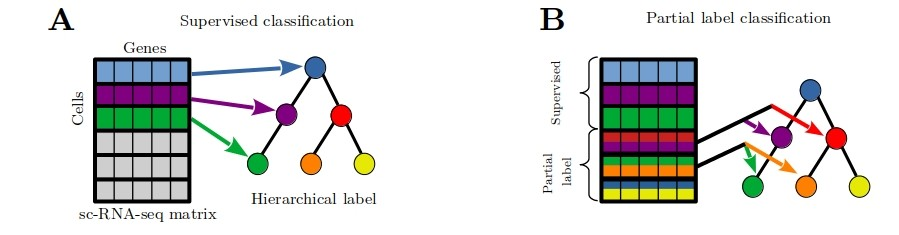

# plRNAseq
partial label learning for single cell RNA seq data classification. This code was produced for this article : biorxiv link  




0) Download  
```
git clone https://github.com/MalekSnous/plRNAseq.git
```   
1) create virtual environment :
```
cd plRNAseq
python3 -m pip install --user --upgrade pip
python3 -m venv plenv
source plenv/bin/activate
pip install -r pl_requirements.txt
```
you can desactivate the virtual environment with :  
```  
deactivate
```


2) unzip data in the current repertory :  

```
mkdir -p data/datasets/  
unzip Packer.zip -d data/datasets/  
unzip Planaria.zip -d data/datasets/  
unzip Paul.zip -d data/datasets/  
```

3) run main script:  (only for experimental datasets, for artificial with prosstt see 7. )
```
python3 -u pl_main.py  
```

4) For average results :  (you may need to search good hyperparameters ...)
```
python3 -u pl_main_average.py
```
5) For Gridsearch hyperparameters :(you may need computational ressources)
```
python3 -u pl_main_average_gridsearch.py
```

6) In addition, if you want to use create new partial lebelling, you can use script :
```
python3 -u create_partial_label_ppp.py
```
7) For prosstt dataset, in order to run , you need to downland some additional packages contained in prosstt package, then create dataset with create_tree.ipynb and partial labelling data :
```
pip install git+git://github.com/soedinglab/prosstt.git
jupyter lab  create_tree.ipynb
python3 -u create_partial_label_prosstt.py
```
   
