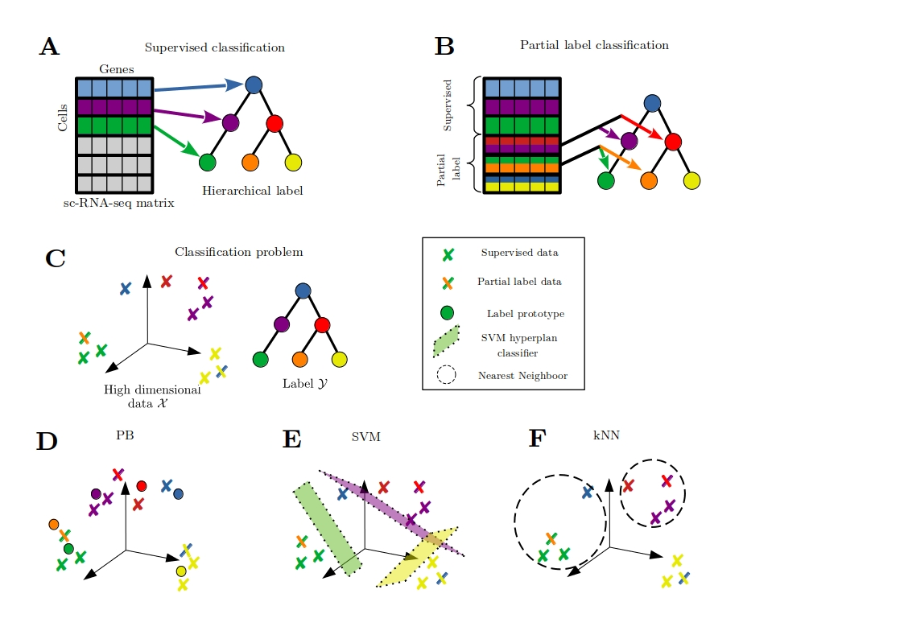

# plRNAseq
partial label learning for single cell RNA seq data classification. This code was produced for this article : biorxiv link


  
1) create virtual environment :
```
mkdir plRNAseq && cd plRNAseq
python3 -m pip install --user --upgrade pip
python3 -m venv plenv
source plenv/bin/activate
pip install -r pl_requirements.txt
```
you can desactivate the virtual environment with :  
```  
deactivate
```


3) unzip data in the current repertory :  

```
mkdir -p data/datasets/  
unzip Packer.zip -p data/datasets/  
unzip Planaria.zip -p data/datasets/  
unzip Paul.zip -p data/datasets/  
```

4) run main script:  
```
python3 -u pl_main.py  
```

6) For average results :  
```
python3 -u pl_main_average.py
```
7) For Gridsearch hyperparameters : Note you may need computation ressources, in this case you may change few thing in code see next paragraph  
```
python3 -u pl_main_average_gridsearch.py
```
7) Need to change PATH file and save file
8) missing things : Prostt data, load  and creation 
   
